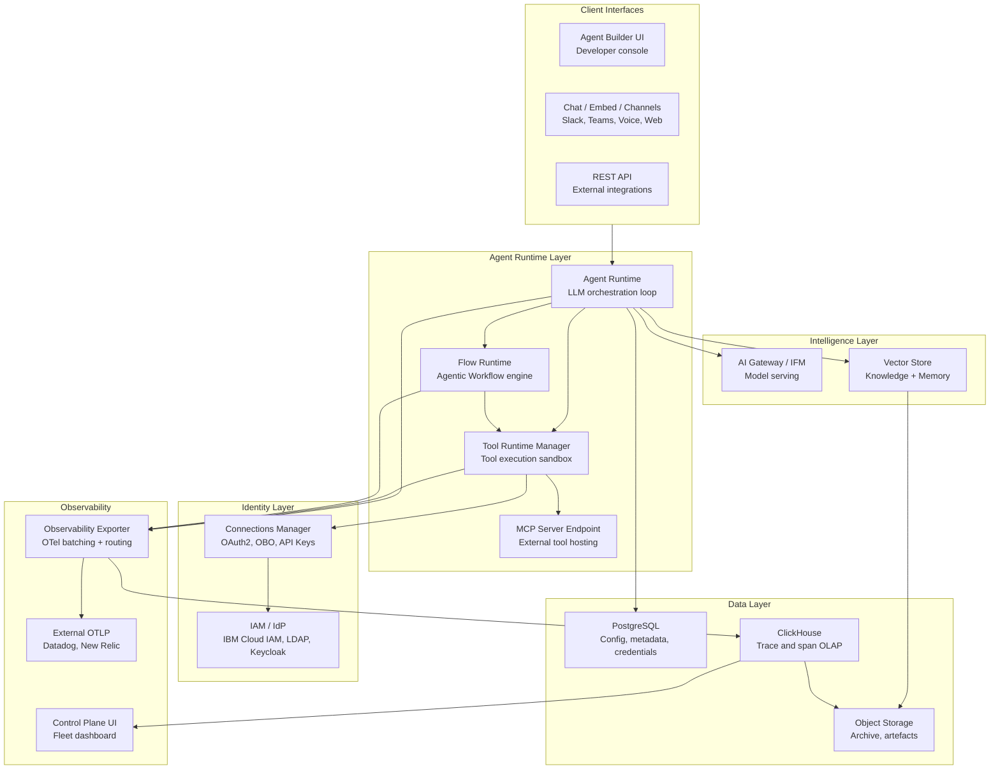
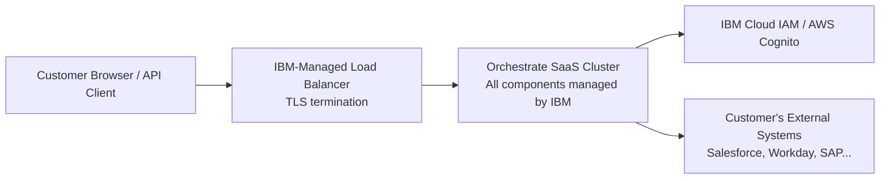
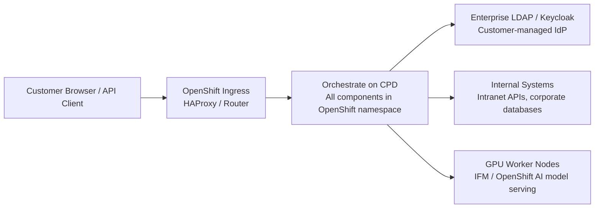

# Architecture

This page describes the component architecture of watsonx Orchestrate and compares the SaaS and on-premises CPD topologies.

---

## Component Architecture

---

## Component Descriptions

| Component | Role | Notes |
|-----------|------|-------|
| **Agent Runtime** | LLM orchestration loop — receives user messages, manages context window, invokes tools and workflows, streams responses | Core execution component |
| **Tool Runtime Manager** | Sandboxed execution for OpenAPI, Python, and MCP tools; credential injection from Connections Manager | Isolated from Agent Runtime |
| **Flow Runtime** | Executes Agentic Workflow node graphs; manages state persistence and HITL callbacks | Stateful, long-running capable |
| **AI Gateway / IFM** | Model serving layer; routes inference requests to IBM Granite, Anthropic Claude, or other LLM providers | SaaS uses AI Gateway; CPD uses IFM (transitioning to OpenShift AI) |
| **Vector Store** | OpenSearch or Elasticsearch instance for knowledge base and memory storage | Tenant-isolated namespaces |
| **PostgreSQL** | Relational database for agent configuration, connection metadata, workflow state, encrypted credentials | Primary operational database |
| **ClickHouse** | Columnar OLAP database for high-throughput trace and span ingestion | Powers all Observability UI analytics |
| **Object Storage** | S3/COS for long-term trace archives and model artefact storage | Lifecycle-managed |
| **Connections Manager** | Manages credential lifecycle; performs OAuth token exchange and refresh | No plaintext credential exposure |
| **Observability Exporter** | Batches and routes spans to ClickHouse and external OTLP collectors | W3C and B3 header support |
| **Control Plane UI** | 7-tab administrative dashboard for fleet governance, FinOps, quality, and reliability | Includes AI assistant |

---

## SaaS vs On-Premises Topology

### SaaS Topology

In SaaS, all components are deployed and managed by IBM within IBM Cloud or AWS. Customers interact through the web UI and APIs only.

**Key characteristics:**

- Zero infrastructure management for customers
- Multi-tenant with cryptographic tenant isolation
- Bi-weekly updates via Argo CD (zero-downtime)
- Monitoring by IBM SRE team

### On-Premises CPD Topology

In on-premises deployments, all components run within the customer's own OpenShift cluster.

**Key characteristics:**

- Customer manages all infrastructure (upgrades, scaling, backup)
- Physical or logical namespace isolation
- Quarterly release cadence (1–3 month SaaS delta)
- Customer is responsible for monitoring, alerting, and incident response

---

## Networking Requirements (On-Premises)

| Traffic Type | Direction | Ports | Notes |
|-------------|-----------|-------|-------|
| User browser traffic | Inbound | 443 (HTTPS) | Terminated at OpenShift Ingress |
| API calls | Inbound | 443 (HTTPS) | Same ingress route |
| External tool API calls | Outbound | 443 (HTTPS) | From Tool Runtime Manager to customer systems |
| LLM inference (if using cloud models) | Outbound | 443 (HTTPS) | Only if using cloud LLM providers from on-prem |
| Enterprise IdP (LDAP/SAML) | Internal | 636 (LDAPS) / 443 | Connections Manager to corporate IdP |

---

## Related References

- [Installation](installation.md) — Step-by-step deployment procedure
- [Troubleshooting](troubleshooting.md) — Component-level diagnostic tools
- [Platform Editions](../reference/platform-editions.md) — Feature and infrastructure comparison
- [Observability](../reference/observability.md) — Detailed observability stack architecture
