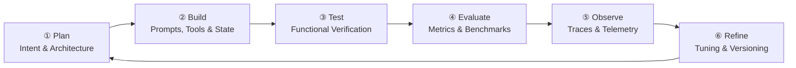

# Agent Development Lifecycle (ADLC)

The Agent Development Lifecycle (ADLC) is IBM's engineering methodology for designing, building, verifying, and maintaining production-grade AI agents in watsonx Orchestrate. It provides a structured, iterative framework for managing the inherently non-deterministic behaviour of LLM-powered agents while meeting enterprise requirements for safety, reliability, and performance.

Unlike traditional software, where passing integration tests guarantees deterministic behaviour in production, agentic AI systems can be affected by prompt changes, tool additions, knowledge base updates, or even foundation model version changes in ways that alter reasoning across unrelated skills. The ADLC accounts for this by making iteration — not completion — the goal.

---

## Phase 1 — Plan

Define cognitive scope, architectural boundaries, and operational constraints before any implementation begins.

**Key activities:**

- Establish the agent's persona, purpose, and hard guardrails
- Identify required external integrations and their authentication requirements (OBO vs service credentials)
- Decide the agent topology: single agent vs multi-agent collaborator hierarchy
- Classify conversation paths: which require deterministic workflow execution vs probabilistic LLM reasoning
- Define latency and SLA targets

**Inputs:** Business use cases, target API specs, auth requirements, SLA budget

**Outputs:** Architecture decision record, tool boundary map, scope matrix

!!! tip "Avoid monolithic agents"
    Avoid designing a single agent with dozens of overlapping tools. Decompose complex domains into discrete specialised tools or collaborating sub-agents. This dramatically improves routing accuracy and reduces hallucinated tool calls.

---

## Phase 2 — Build

Translate the plan into platform artefacts using the Agent Builder UI or the REST API.

**Key activities:**

- Author system instructions using Role–Goal–Context–Constraints structure
- Register OpenAPI, Python, MCP, and Workflow tools
- Configure semantic search over enterprise knowledge sources
- Establish credential connections via the Connections Manager
- Define collaborator bindings if using a multi-agent topology

**Inputs:** System prompt templates, validated OpenAPI specs, Python scripts, vector indices, IdP configs

**Outputs:** Configured and versioned agent manifest ready for testing

!!! tip "Invest in tool parameter descriptions"
    The LLM uses tool parameter `description` fields to extract and map arguments from user utterances. Ambiguous or missing descriptions are the primary cause of hallucinated tool calls. Write descriptions as if explaining the parameter to a new colleague.

---

## Phase 3 — Test

Verify functional behaviour with deterministic test cases before moving to automated evaluation.

**Key activities:**

- Run scripted test conversations covering happy path, edge cases, and failure scenarios
- Verify tool invocations fire with correct schemas and credentials
- Validate context variable propagation across multi-turn conversations
- Test auth refresh flows by simulating expired tokens
- Confirm fallback and error-handling behaviour

**Inputs:** Representative conversation scenarios, test credentials, edge-case prompts

**Outputs:** Functional test logs, tool payload validation reports, verified baseline runs

!!! warning "Python tool testing"
    Direct standalone testing of Python tools without an agent is not yet supported. Test Python logic locally with mock inputs before deployment, then validate through agent invocation.

---

## Phase 4 — Evaluate

Shift from manual testing to systematic, quantitative benchmarking using the Agent Ops evaluation framework.

**Key activities:**

- Upload curated golden test datasets (multi-turn conversation pairs with expected tool calls and outputs)
- Run automated evaluation pipelines measuring Journey Success, Tool Call F1, Journey Completion, and Routing Accuracy
- Execute LLM-as-judge rubric evaluations for custom quality criteria
- Compare agent variants (e.g., different models or instruction versions) on the same benchmark

**Inputs:** Golden test datasets, scoring rubrics, evaluation config

**Outputs:** Quantitative performance scorecard, regression reports

!!! tip "Build your golden dataset from failures"
    Every production failure caught in Observe should be converted into a new test case in your golden dataset before you fix it. This prevents regression.

---

## Phase 5 — Observe

Once deployed to staging or production, monitor the agent continuously through real-time telemetry.

**Key activities:**

- Review span waterfall traces to identify latency hotspots (LLM reasoning vs tool execution vs network)
- Monitor token consumption trends to predict context compaction events
- Capture and triage user feedback (thumbs up/down)
- Set up alerts for error rate spikes or latency P95 breaches
- Use the Control Plane dashboard for fleet-level health

**Inputs:** Live traffic, user feedback, OpenTelemetry traces, token usage metrics

**Outputs:** SLA dashboards, alert notifications, failure trace repository

---

## Phase 6 — Refine

Use production telemetry and evaluation regressions to drive targeted improvements, then re-enter the lifecycle.

**Key activities:**

- Analyse failed interaction traces; identify root cause (instruction ambiguity, tool schema, model routing, knowledge gap)
- Refine system instructions or tool descriptions based on failure patterns
- Update knowledge base embeddings when factual accuracy issues are found
- Use JEPA or ACE optimisation algorithms for automated prompt improvement
- Commit changes as a new version; promote to production only after evaluation gates pass

**Inputs:** Failure traces, negative user feedback, updated API specs, evaluation error clusters

**Outputs:** Updated agent version with improved instructions, refined tool schemas, new test cases

---

## The Iterative Nature

The ADLC is a continuous loop, not a linear waterfall. An agent that passes all evaluation benchmarks on day one may degrade over time as:

- Underlying foundation models are updated
- Connected APIs change their schemas or response structures
- Knowledge bases become stale
- Business requirements evolve

Treat agent development as an ongoing engineering discipline, not a one-time delivery. Production agents should have scheduled evaluation runs and a defined refine cadence (e.g., monthly).

---

## Related References

- [Agent Building Blocks](agent-building-blocks.md) — The six components you configure in the Build phase
- [Tool Types](tool-types.md) — Runtime architecture and testing constraints for each tool type
- [Evaluation](evaluation.md) — Deep dive on metrics, test case upload, and LLM-as-judge
- [Observability](observability.md) — Tracing, span attributes, and the 11 observability UI features
- [Control Plane](control-plane.md) — Fleet governance, version promotion, and the Control Plane AI assistant
