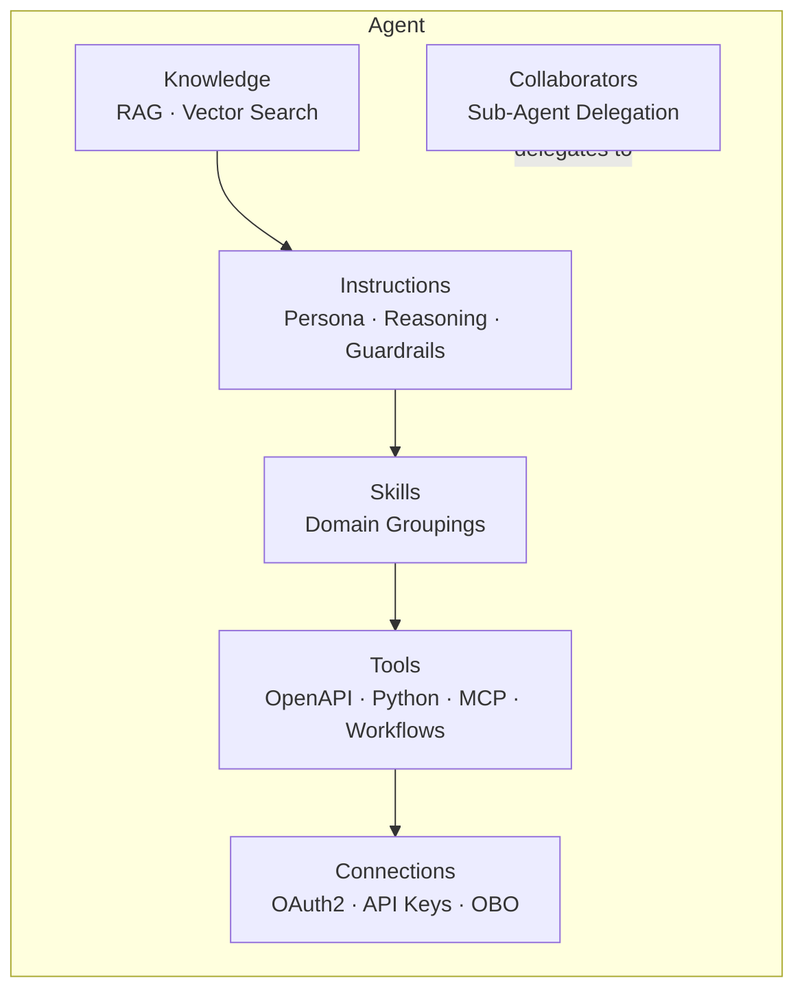

# Agent Building Blocks

Every agent in watsonx Orchestrate is a composite entity assembled from six building blocks. These blocks decouple persona and reasoning logic (Instructions) from execution capabilities (Tools), grounding data (Knowledge), enterprise identity (Connections), and compositional architecture (Collaborators), making each concern independently configurable and reusable.

---

## Instructions

**What it is:** The system-level directive that governs the agent's identity, reasoning strategy, output style, and hard constraints. Instructions are the first thing in the LLM's context window on every turn.

**Role:** Instructions establish the agent's decision-making policy — how it interprets user intent, chooses between available tools, handles ambiguity, and enforces safety boundaries.

**Configuration:**

- Authored in the Agent Builder UI or via the `system_prompt` field in the REST API
- Recommended maximum: 1,500–2,500 tokens, leaving sufficient window for tool definitions and conversation history
- Follow the **Role–Goal–Context–Constraints** pattern for clarity

**Relationships:** Instructions reference the domain defined by Skills, determine when to query Knowledge, and govern how Tools are selected and sequenced.

---

## Skills

**What it is:** A high-level business capability assigned to an agent (e.g., "Invoice Processing", "Employee Onboarding", "IT Helpdesk"). Skills group related tools, knowledge sources, and instruction fragments into a cohesive domain.

**Role:** Skills enable selective context loading — in complex deployments, only the tool definitions and knowledge indices relevant to the active skill are loaded into the context window, preventing prompt bloat.

**Configuration:**

- Assigned during agent authoring in the Builder workspace
- Each skill can bundle multiple Tools, explicit invocation triggers, and guardrail rules

**Relationships:** Skills act as the semantic bridge between high-level Instructions and the concrete Tools and Knowledge sources they govern.

---

## Knowledge

**What it is:** Enterprise documentation, wikis, and structured data retrieved dynamically at query time via Retrieval-Augmented Generation (RAG) pipelines, without requiring model fine-tuning.

**Role:** Knowledge grounds agent responses in verified, up-to-date enterprise content, eliminating hallucination on domain-specific questions.

**Configuration:**

- Documents are chunked (default: 512-token chunks with 50-token overlap), embedded, and indexed in the tenant's vector store
- Vector store technology is deployment-specific: OpenSearch on AWS, Elasticsearch on IBM Cloud and on-premises CPD
- Metadata filtering enforces multi-tenant access controls — users only retrieve knowledge they are authorised to see

**Relationships:** Retrieved knowledge chunks are injected alongside Instructions before any tool selection occurs.

---

## Tools

**What it is:** Executable interfaces that allow the agent to read state from, or execute actions against, external enterprise systems, databases, APIs, and compute runtimes.

**Role:** Tools transform the LLM from a passive text generator into an active software agent capable of executing real business transactions and querying live data.

**Configuration:**

- Five supported patterns: OpenAPI, Python, MCP Server, Agent Workflow, Toolkit
- Configured in Tool Studio and managed at runtime by the Tool Runtime Manager
- Tool descriptions and parameter `description` fields are parsed by the LLM for argument binding — quality here directly determines tool call accuracy

**Relationships:** Tools depend on Connections for authentication credentials. Tool outputs are injected back into context to satisfy the reasoning requirements set by Instructions.

See [Tool Types](tool-types.md) for the full technical specification.

---

## Collaborators

**What it is:** A multi-agent hierarchical routing mechanism where a primary supervisor agent delegates sub-tasks to specialised sub-agents (internal or external).

**Role:** Collaborators enable modular decomposition — instead of burdening a single agent with hundreds of tools, a supervisor routes intents to dedicated domain agents (HR, Finance, IT), each with independent context, memory, and toolsets.

**Configuration:**

- Configured in Agent Builder under Collaborator Settings
- Supports synchronous (blocking) and asynchronous delegation
- External agents built in LangGraph, CrewAI, or Bee Agent Framework can be registered as collaborators via standard agentic endpoints

**Relationships:** A Collaborator acts as a specialised meta-Tool from the supervisor's perspective, except it executes its own full agent loop internally.

---

## Connections

**What it is:** The security and identity provider layer that manages authentication credentials, OAuth 2 token negotiations, API keys, and secure secret injection for tool calls.

**Role:** Connections isolate sensitive credentials from the agent prompt context. All external tool calls execute under validated, auditable security principals.

**Configuration:**

- Managed by the Connections Manager
- Two delegation models:
  - **Team credentials:** shared service account credentials (functional IDs) — appropriate for back-end integrations not tied to a specific user
  - **Member credentials:** user-delegated credentials where the agent acts on behalf of the authenticated end user (On-Behalf-Of / OBO pattern)
- Supports 7 auth types: OAuth 2 Code, OAuth 2 Client Credential, OAuth 2 Password, OAuth 2 JWT, Bearer Token, API Key, Key-Value

**Relationships:** Connections provide the mandatory auth runtime consumed by Tools when executing against external endpoints.

See [Connections](connections.md) and [Security](security.md) for full specifications.

---

## Summary Table

| Building Block | Primary Purpose | Configuration Surface | Required? | Runtime Component |
|---|---|---|---|---|
| **Instructions** | Persona, reasoning policy, guardrails | Agent Builder / REST API | Yes | LLM context engine |
| **Skills** | Domain grouping, selective tool loading | Agent Builder | No | Agent orchestration engine |
| **Knowledge** | Semantic RAG grounding | Knowledge Studio / vector store | No | OpenSearch / Elasticsearch |
| **Tools** | Execute actions, query live data | Tool Studio / REST API | No | Tool Runtime Manager |
| **Collaborators** | Sub-agent delegation, multi-agent hierarchy | Agent Builder | No | Multi-agent router |
| **Connections** | Auth credentials, OAuth 2, OBO tokens | Connections Manager | Conditional | Identity / Connections Manager |

---

## Related References

- [Tool Types](tool-types.md) — Full technical spec for OpenAPI, Python, MCP, Workflow, and Toolkit tools
- [Connections](connections.md) — Auth types, connection lifecycle, and token refresh
- [Security](security.md) — OBO flows and SSO integration
- [Agentic Workflows](agentic-workflows.md) — Using deterministic workflows as agent tools
- [ADLC](adlc.md) — How building blocks fit into the development lifecycle
