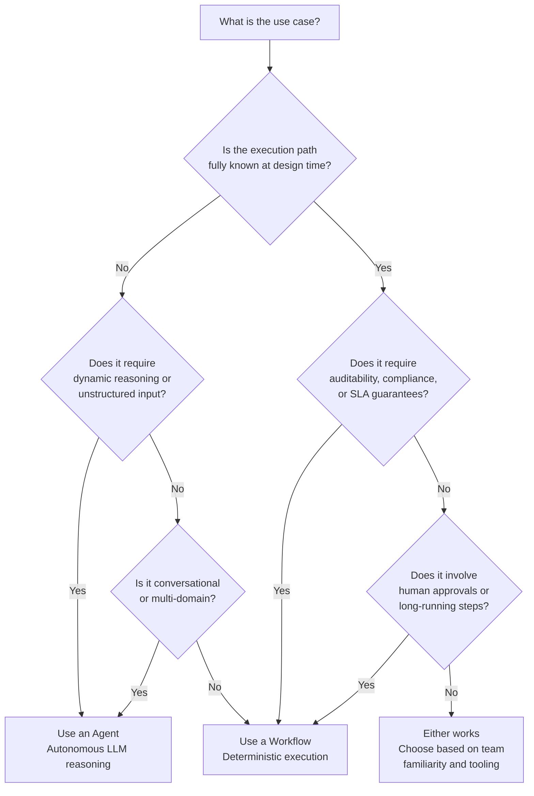

# Agent vs Workflow

One of the most important architectural decisions when building with watsonx Orchestrate is choosing whether a given use case is best served by an **autonomous agent**, a **deterministic agentic workflow**, or a **combination of both**. This page provides the decision framework, comparison matrix, and integration patterns to make that choice confidently.

---

## Decision Framework

---

## Side-by-Side Comparison

| Dimension | Autonomous Agent | Agentic Workflow |
|-----------|-----------------|-----------------|
| **Execution model** | LLM decides what to do next on each turn | Explicit node graph executed in defined order |
| **Predictability** | Non-deterministic — same input may produce different paths | Deterministic — same input always executes same path |
| **State durability** | Session-scoped; lost when session ends | Persisted at every node; survives restarts and long pauses |
| **Auditability** | Trace-level (tool calls, LLM turns) | Step-level — every node execution is logged with inputs and outputs |
| **Human-in-the-loop** | Possible but not natively orchestrated | First-class via User Activity nodes |
| **Scheduling** | Not supported natively | Supported (minimum 5-minute interval) |
| **Duration** | Short to medium (session-bound) | Short to very long (minutes to months) |
| **Best for** | Conversational, unstructured, multi-domain, dynamic | Compliance, approvals, straight-through processing, regulated workflows |
| **Risk of unexpected behaviour** | Higher (LLM non-determinism) | Very low (explicit graph) |
| **Development complexity** | Lower initial build, higher ongoing tuning | Higher initial build, lower operational variability |

---

## When to Use an Agent

Choose an agent when the system cannot know the execution path at design time, or when the value comes from the agent's ability to reason flexibly:

- **Variable or unstructured inputs** — the user might ask anything; the agent decides which tools to invoke
- **Multi-domain question answering** — the agent synthesises answers from multiple knowledge sources and tools
- **Exploratory or research tasks** — the right sequence of actions depends on what earlier steps reveal
- **Conversational human interaction** — back-and-forth dialogue where the user's next message is unpredictable
- **Dynamic routing** — the correct sub-agent or tool depends on context discovered mid-conversation

---

## When to Use a Workflow

Choose a workflow when the process is known, regulated, or must behave identically every time:

- **Repeatability and auditability required** — banking transactions, HR actions, compliance checks
- **Ordered steps with no exception** — "the agent must always do A, then B, then C, in that order, no deviation"
- **Human approval gates** — document routing, expense approval, contract sign-off
- **Long-running processes** — processes that take hours, days, or weeks to complete
- **Scheduled execution** — batch jobs, nightly reports, periodic data synchronisation
- **Straight-through processing** — high-volume, low-touch business operations where speed and consistency matter

---

## Integration Patterns

The most powerful architectures combine agents and workflows. Three common integration patterns:

### Pattern 1: Workflow as a Tool

The workflow is registered as a tool available to an agent. The agent decides *when* to invoke the workflow based on user intent; once invoked, the workflow executes deterministically.

**Use when:** The overall interaction is conversational, but one specific capability within it requires a structured, auditable process.

**Example:** An HR agent handles general HR questions conversationally. When the user requests leave approval, the agent invokes a Leave Approval Workflow, which collects manager approval and updates the HR system in a defined sequence.

### Pattern 2: Agent Node Inside a Workflow

A workflow step requires flexible reasoning — for example, classifying an incoming document, summarising a report, or extracting structured data from free text. An Agent node is placed inside the workflow to handle that step; the workflow resumes with the agent's output.

**Use when:** Most of the process is deterministic, but one step requires LLM reasoning.

**Example:** An invoice processing workflow extracts fields from uploaded documents using an Agent node (which handles varied invoice formats), then routes the structured data through deterministic approval and payment steps.

### Pattern 3: MCP Server Wrapping BAW/BAMOE

Existing back-office workflows built in IBM Business Automation Workflow (BAW) or Business Automation Manager Open Edition (BAMOE) can be exposed to watsonx Orchestrate agents as MCP tools. The agent calls the BAW process the same way it calls any other tool.

**Use when:** You have existing BAW/BAMOE investments and want to surface their capabilities to AI agents without re-building them.

---

## Positioning vs Other Orchestration Products

| Product | Primary Use | Relationship to Orchestrate |
|---------|------------|----------------------------|
| **Agentic Workflows** (built-in) | AI-first, user-facing, conversational orchestration with HITL | Native Orchestrate capability — start here |
| **LangGraph** | Low-level AI application graph construction; short-running, developer-centric | Use for external agent frameworks; register as an External Agent in Orchestrate |
| **IBM BAW / BAMOE** | Back-office, long-running BPM; legacy portal/task-list UX | Expose via MCP to make existing processes available to agents |

!!! tip "Default to Agentic Workflows first"
    For new watsonx Orchestrate solutions, evaluate Agentic Workflows before reaching for LangGraph or BAW. Agentic Workflows are native, require no additional infrastructure, and integrate directly with the Orchestrate connection, memory, and observability stack.

---

## Related References

- [Agentic Workflows](agentic-workflows.md) — Full technical specification for all node types, scheduling, and callbacks
- [Tool Types](tool-types.md) — How workflows are registered and invoked as tools
- [HOWTO: Build an Agentic Workflow](../howto/build-agentic-workflow.md) — Step-by-step build guide
- [Cookbook: Approval Workflow](../cookbook/agentic-workflow-approval.md) — Practical HITL approval workflow recipe
