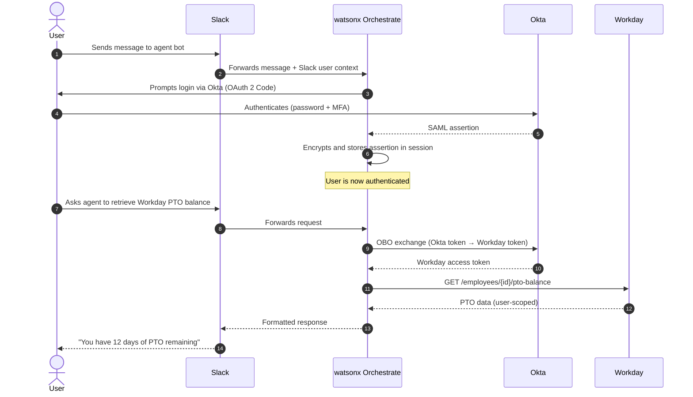

# Channels

watsonx Orchestrate agents can be deployed across a range of enterprise and consumer communication channels. This page documents the full channel matrix, feature parity, SSO support, and the `context_access_enabled` flag that allows agents to personalise responses based on channel-specific metadata.

---

## Channel Matrix

| Channel | Type | SSO Support | Forms/HITL | Knowledge Search | Tool Usage | Streaming |
|---------|------|-------------|------------|-----------------|-----------|-----------|
| **Web Chat (Embedded)** | Customer / Internal | OAuth 2 Code (Sep) | Yes | Yes | Yes | Yes |
| **Microsoft Teams** | Enterprise | Yes (Entra ID) | Yes (full parity) | Yes | Yes | Yes |
| **Slack** | Enterprise | Yes (Okta / SAML) | Yes (full parity) | Yes | Yes | Yes |
| **WhatsApp** | Customer (via Twilio) | No | Text-based only | Yes | Yes | No |
| **SMS** | Customer (via Twilio) | No | Text-based only | Yes | Yes | No |
| **Facebook Messenger** | Customer | No | Limited | Limited | Limited | No |
| **Genesys Bot Connector** | Contact Centre | Via Genesys | No | Yes | Yes | No |
| **Voice (SIP/Telephony)** | Contact Centre | No | Voice-based | Yes | Yes | Streaming audio |
| **API (headless)** | Custom integration | Token-based | Yes (JSON) | Yes | Yes | Yes |

---

## Enterprise Channels: Teams and Slack

### Microsoft Teams

Teams integration provides full feature parity with the web chat experience:

- Forms and approval workflows render natively as Teams Adaptive Cards
- Knowledge search results are formatted for Teams message cards
- SSO is federated through Microsoft Entra ID — users authenticate once via their organisational Microsoft account
- The agent sees the user's Entra identity, enabling OBO token exchange for downstream Microsoft 365 and Dynamics integrations

### Slack

Slack integration also provides full feature parity:

- Forms render as Block Kit modal dialogs
- SSO is federated through Okta (or any SAML 2.0-compatible IdP)
- The `context_access_enabled` flag surfaces the user's Slack workspace ID and user ID to the agent
- Supports the full Slack + Okta + Workday OBO pattern (see [Security](security.md#sso-integration))

### Slack + Okta + Workday SSO Flow



---

## Customer Care Channels

### WhatsApp and SMS (via Twilio)

- Deployed through Twilio integration
- Supports text messages, simple forms, and knowledge-grounded answers
- Tool usage is supported but responses must be kept concise for mobile readability
- File attachments are not supported on SMS; WhatsApp supports image attachments only

### Genesys Bot Connector

Used in contact centre deployments where Genesys Cloud CX is the telephony backbone:

- Enables **transfer to human agent** — the Orchestrate agent hands off to a live Genesys agent when escalation is required
- Supports **live transfer** with context — conversation history is passed to the human agent
- Can be exposed as a WhatsApp bot through Genesys's WhatsApp integration

---

## The `context_access_enabled` Flag

When `context_access_enabled` is set to `true` in the agent configuration, the platform automatically indexes channel-specific metadata and makes it available to the agent as context variables.

Metadata surfaced per channel:

| Channel | Metadata Available |
|---------|-------------------|
| Slack | `slack.workspace_id`, `slack.user_id`, `slack.channel_id` |
| WhatsApp | `whatsapp.phone_number`, `whatsapp.country_code` |
| SMS | `sms.phone_number` |
| SIP/Telephony | `sip.caller_id`, `sip.dnis`, `sip.session_id` |
| Teams | `teams.user_id`, `teams.tenant_id`, `teams.channel_id` |

This allows a single agent to personalise its behaviour based on which channel the user is communicating from — for example, providing shorter responses on SMS, switching language based on country code, or routing to different tools based on the originating workspace.

---

## Channel Adaptation Best Practices

### Language and Cultural Context

Deploying one agent for all languages is technically possible but not recommended for production customer-facing deployments. Language carries cultural nuance that affects tone, formality, and conversational patterns beyond simple translation.

!!! tip "One agent per language"
    For customer-facing deployments in multiple languages, create a dedicated agent per language. Configure each agent's system instructions with culturally appropriate tone and conventions, not just translated text.

### Response Format Adaptation

The same agent can format responses differently per channel. Include channel-aware formatting instructions in the system prompt:

```
When responding via SMS, limit responses to 160 characters where possible.
When responding via Teams, use markdown formatting (bold, lists).
When responding via Voice, avoid markdown — use plain, spoken-language sentences.
```

### Empathic Tone for Voice and Customer Care Channels

For voice and contact centre channels, system instructions should explicitly specify:

- Acknowledge the user's issue before attempting to resolve it
- Use explicit transitional phrases ("I'm looking that up now...", "Let me check that for you...")
- Avoid jargon or technical terms that are confusing when spoken aloud

---

## Related References

- [Voice](voice.md) — Voice configuration schema, STT/TTS providers, SIP and Genesys setup
- [Security](security.md) — OBO flows and SSO architecture underlying channel authentication
- [Connections](connections.md) — Credential configuration for channel-specific OAuth flows
- [HOWTO: Set Up Voice](../howto/set-up-voice.md) — Step-by-step voice channel configuration
- [Cookbook: Slack + Okta + Workday SSO](../cookbook/slack-sso-workday.md) — End-to-end Slack SSO recipe
- [Lab 9: Voice & Channels](../labs/lab-09-voice-channels.md) — Hands-on lab configuring Slack and voice channels
