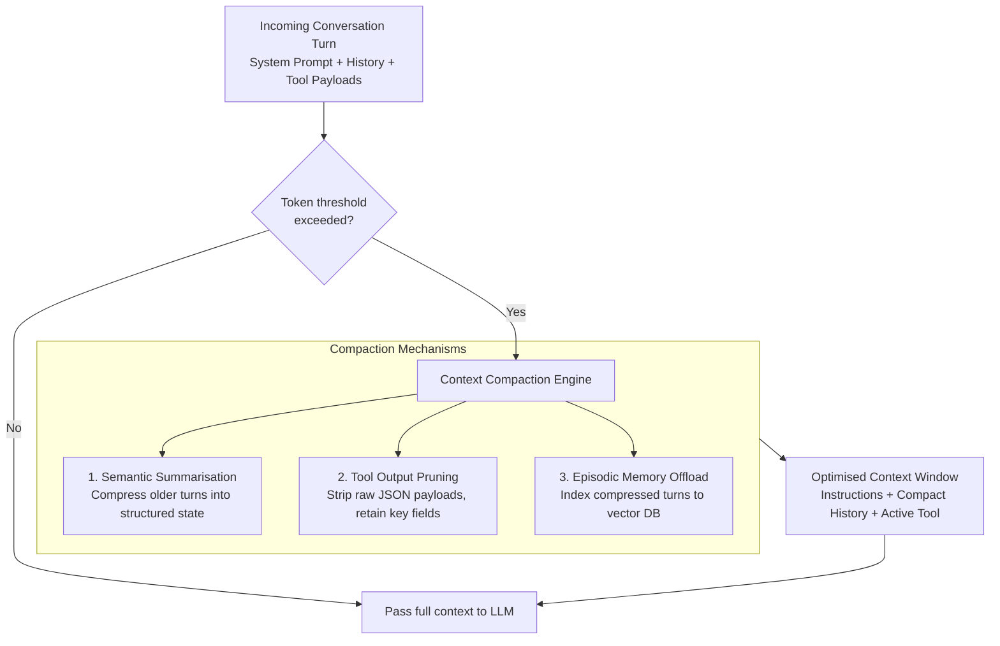

# Supported Models

watsonx Orchestrate supports a curated set of enterprise-grade foundation models. Model availability depends on deployment edition (SaaS vs CPD) and tenant entitlement (Standard vs Premium).

---

## Model Availability Matrix

| Model | Provider | Standard Tenant | Premium Tenant | Context Window | Recommended For |
|-------|----------|----------------|---------------|----------------|-----------------|
| `granite-3-8b-instruct` | IBM | Yes | Yes | 128k tokens | High-speed routing, intent classification, single-step tool calls, voice orchestration |
| `granite-3-20b-instruct` | IBM | Yes | Yes | 128k tokens | General reasoning, structured data extraction, workflow decisions |
| `granite-3-70b-instruct` | IBM | Yes | Yes | 128k tokens | Complex multi-step reasoning, code generation, advanced synthesis |
| `llama-3-3-70b-instruct` | Meta | Yes | Yes | 128k tokens | General-purpose reasoning, multilingual conversations, agent planning |
| `mistral-large` | Mistral AI | Optional | Yes | 128k tokens | Complex reasoning, multilingual tasks, code analysis |
| `claude-3-haiku` | Anthropic | No | Yes | 200k tokens | Fast tool calling, real-time voice, conversational RAG |
| `claude-3-5-sonnet` | Anthropic | No | Yes | 200k tokens | Complex autonomous agents, multi-agent orchestration, intricate tool binding |

!!! note "Anthropic Claude on Premium Tenants"
    Claude 3.5 Sonnet and Claude 3 Haiku are available exclusively on **Premium Tenant** entitlements in SaaS environments. Claude 3.5 Sonnet delivers the highest tool-call accuracy and instruction-following precision of any supported model, making it the preferred choice for complex multi-agent topologies where routing errors are costly.

---

## Context Compaction

In long-running sessions or multi-step tool executions, raw token accumulation eventually approaches model limits. watsonx Orchestrate implements an automatic **Context Compaction Engine** to manage this transparently.

**How it works:**

1. **Threshold monitoring** — The runtime tracks token consumption against the active model's context ceiling (threshold is typically 70% of available context)
2. **Semantic summarisation** — Older dialogue turns are condensed by a high-speed summarisation model (Granite-8B) into a dense factual summary
3. **Tool output pruning** — Intermediate raw tool outputs (e.g., a 100-row JSON response) are pruned from active memory once the agent has extracted the needed fields
4. **Episodic memory offloading** — Pruned context is vectorised and stored in the tenant's vector database, retrievable on demand via semantic search

**Why it matters:**

- **Latency** — Time-to-First-Token (TTFT) increases linearly with prompt length; compaction keeps prompts lean
- **Cost** — Reduces cumulative token burn in multi-turn engagements
- **Accuracy** — Prevents "lost in the middle" degradation where LLMs fail to attend to system instructions buried under massive conversational histories

---

## Model Selection Guidance

### High-speed routing and low-latency micro-tasks

**Use:** `granite-3-8b-instruct` or `claude-3-haiku`

Voice conversational agents, initial intent classifiers, parameter extraction, single-step API dispatch. Minimum Time-to-First-Token and minimal compute footprint.

### Standard enterprise business workflows

**Use:** `granite-3-20b-instruct` or `llama-3-3-70b-instruct`

Multi-turn customer service, database query generation, deterministic workflow decision nodes, knowledge base RAG synthesis. Balanced reasoning depth with optimal cost-per-token economics.

### Complex autonomous multi-agent topologies

**Use:** `claude-3-5-sonnet` or `granite-3-70b-instruct`

Primary supervisor agents, code synthesis, intricate multi-tool dependency chaining, unstructured document analysis. Superior instruction-following precision and zero-shot tool-call schema generation.

!!! tip "Cost vs accuracy trade-off"
    Run evaluations (see [Evaluation](evaluation.md)) across multiple model configurations before committing to a production model. Tool Call F1 and Journey Success metrics vary meaningfully between model families for the same agent — especially for ambiguous or multi-intent user requests.

---

## Related References

- [Platform Editions](platform-editions.md) — SaaS vs CPD model serving infrastructure (AI Gateway vs IFM)
- [Agent Building Blocks](agent-building-blocks.md) — Configuring instructions to maximise model reasoning
- [Evaluation](evaluation.md) — Benchmarking tool-call accuracy and journey success across model variants
- [Optimization](optimization.md) — Prompt distillation and token minimisation techniques
