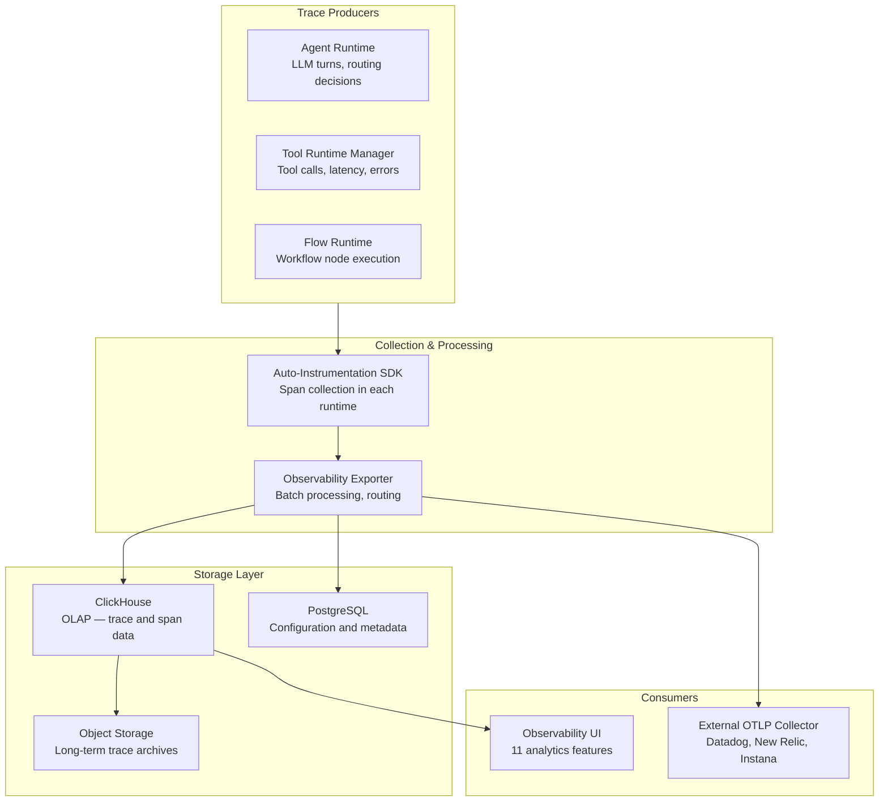

# Observability

watsonx Orchestrate ships a full-stack observability system that instruments every component of the agent runtime — LLM reasoning, tool execution, workflow steps, knowledge retrieval, and user interactions — and surfaces the resulting telemetry through a built-in UI and an OpenTelemetry-compatible export interface.

---

## Stack Architecture



**Key components:**

- **Auto-instrumentation SDK** — embedded in each runtime component; no developer action required to capture standard spans
- **ClickHouse** — columnar OLAP store used for high-throughput span ingestion and fast analytical queries
- **PostgreSQL** — stores configuration, tenant metadata, and aggregated rollup metrics
- **Object Storage (S3/COS)** — long-term archive for trace data beyond the 30-day hot retention window
- **Exporter** — routes spans to storage and external collectors; supports batching and tenant isolation

---

## Trace Context Propagation

watsonx Orchestrate uses **W3C Trace Context** (`traceparent`, `tracestate`) and **B3** headers for distributed trace correlation. This means:

- A trace initiated by a user message propagates through every component (agent → tool call → external API) as a single trace tree
- External systems that receive REST calls from Orchestrate tools carry the `traceparent` header, allowing end-to-end tracing even across system boundaries
- Incoming requests from external systems can inject their own `traceparent` to correlate Orchestrate execution within a broader trace

### Using Trace Context in Custom Tools

Python tools and MCP servers can read the active trace context via the `context` parameter injected by the runtime:

```python
async def main(params: dict, context: dict) -> dict:
    trace_id = context.get("trace_id")
    span_id = context.get("span_id")
    # Pass these to downstream systems for end-to-end correlation
```

---

## Custom Span Attributes

Python tools can add custom attributes to the active span using the **span logger API**. This allows tool-level business context to be captured in traces — for example, the customer ID retrieved, the number of records processed, or the outcome of a business rule evaluation.

```python
from ibm_watsonx_orchestrate.observability import span_logger

async def main(params: dict, context: dict) -> dict:
    result = fetch_customer(params["customer_id"])

    # Add custom attributes to the active span
    span_logger.set_attribute("customer.id", params["customer_id"])
    span_logger.set_attribute("records.returned", len(result))
    span_logger.set_attribute("cache.hit", result.from_cache)

    return result
```

!!! note "Attribute size limit"
    The total size of custom span attributes per tool invocation is limited to approximately **10 KB**. Exceeding this limit causes attributes to be silently truncated.

---

## Callbacks and Span Restoration

When a Python tool uses async callbacks (fire-and-forget patterns where the tool returns immediately and a callback fires later), the active trace context must be explicitly restored in the callback to maintain span parentage:

```python
import asyncio
from ibm_watsonx_orchestrate.observability import restore_span_context

async def main(params: dict, context: dict) -> dict:
    # Save context before scheduling callback
    saved_context = context.copy()

    async def callback():
        async with restore_span_context(saved_context):
            # Spans created here will be children of the original tool span
            span_logger.set_attribute("callback.completed", True)

    asyncio.create_task(callback())
    return {"status": "processing"}
```

---

## Parallel Tool Execution

When an agent invokes multiple tools in parallel (concurrent tool calls), the observability system maintains correct parent-child span relationships:

- Each parallel tool invocation creates a **sibling span** under the same parent agent turn span
- The spans are linked by a common `trace_id` with different `span_id` values
- The waterfall view in the UI renders parallel tool spans side-by-side, making it easy to identify which tool was the latency bottleneck

---

## Data Retention

- **Hot retention:** 30 days in ClickHouse (full span detail, queryable)
- **Cold archive:** Beyond 30 days, data is moved to object storage (S3/COS) in compressed Parquet format
- **On-Prem CPD:** Retention period is configurable by the platform operator; default is 30 days

---

## 11 UI Observability Features

| # | Feature | Description |
|---|---------|-------------|
| 1 | **Conversation Analytics** | Fleet-level dashboard showing aggregate message volume, session counts, and success rates |
| 2 | **Agent-Specific Analytics** | Drill-down view for a single agent — conversations, users, duration, token consumption |
| 3 | **Feedback Capturing** | Aggregates user thumbs up/down ratings; shows feedback ratio over time |
| 4 | **Agent Traces** | Detailed span waterfall view — every LLM turn, tool call, and retrieval step with latency |
| 5 | **Error Analysis** | Root-cause investigation for failed sessions — surfaces the specific span and error message |
| 6 | **Latency Analysis** | P50, P95, P99 latency distributions for agents and individual tools |
| 7 | **Tool Insights** | Tool-level success/failure rates, average execution time, error classification |
| 8 | **Knowledge Search Analytics** | RAG metrics — retrieval hit rate, chunk relevance scores, no-answer rate |
| 9 | **Helpfulness & Hallucination Scores** | LLM-as-judge metrics computed automatically; surfaced per agent over time |
| 10 | **Runtime Inventory** | Count and status of all deployed agents, tools, and knowledge bases |
| 11 | **External Collectors** | Push traces to external platforms via OTLP (Datadog, New Relic, Instana, Splunk) |

---

## External OTLP Export

Traces can be forwarded to any OTLP-compatible observability platform. Configuration requires:

1. An OTLP endpoint URL (e.g., `https://otlp.nr-data.net:4317` for New Relic)
2. An authentication header (API key or bearer token for the target platform)
3. The exporter configuration in the Orchestrate admin settings or `values.yaml` (on-premises CPD)

```yaml
# On-prem CPD: values.yaml example
observability:
  otlp_export:
    enabled: true
    endpoint: "https://otlp.nr-data.net:4317"
    headers:
      "api-key": "<new-relic-license-key>"
    protocol: grpc  # or http/protobuf
```

On SaaS, external OTLP export is configured through the Orchestrate admin console under **Observability > Export Settings**.

---

## Related References

- [Control Plane](control-plane.md) — Fleet-level dashboard with FinOps, quality, and reliability tabs
- [HOWTO: Export Traces](../howto/export-traces.md) — Step-by-step guide to configuring external OTLP export
- [Cookbook: Custom Observability](../cookbook/custom-observability.md) — Recipe for pushing traces to Datadog/New Relic
- [Lab 8: Observability](../labs/lab-08-observability.md) — Hands-on lab exploring traces, custom attributes, and external export
