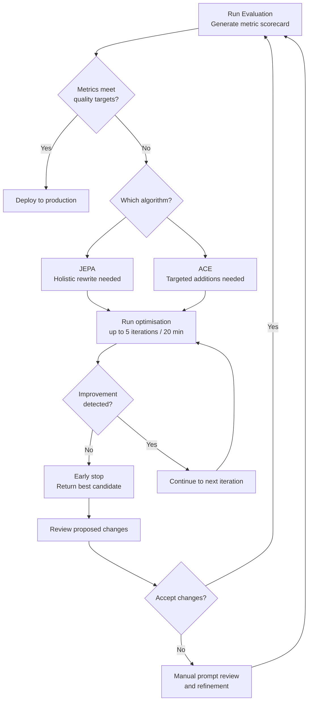

# Optimization

Agent Ops optimisation is the automated prompt improvement layer that follows evaluation in the ADLC. When evaluation reveals that an agent is not meeting quality targets, optimisation algorithms analyse the failures and iteratively rewrite the agent's system instructions to improve performance — without requiring manual prompt engineering for each fix.

---

## Optimisation Algorithms

Two algorithms are available: **JEPA** and **ACE**. They take different approaches to the same goal — improving Journey Success and Tool Call F1 scores by modifying agent instructions.

### JEPA (Iterative Rewrite)

JEPA rewrites the entire system prompt iteratively, generating a candidate improved prompt, evaluating it against the golden test set, and accepting or rejecting the candidate based on metric improvement.

**How it works:**

1. JEPA analyses the failing test cases from the evaluation run
2. It generates a candidate rewrite of the system instructions that addresses the identified failure patterns
3. The candidate is evaluated against the full test set
4. If metrics improve, the candidate becomes the new working instruction set; if not, the candidate is discarded
5. Steps 2–4 repeat for up to **5 iterations** or until the improvement threshold is met

**Characteristics:**

- Produces holistic instruction rewrites — may change tone, structure, and specificity simultaneously
- Well-suited to agents whose instructions have accumulated technical debt (unclear, outdated, or internally contradictory guidance)
- Higher risk of drifting far from original intent; review rewrites carefully before deploying
- Timeout: **20 minutes** — evaluations that do not converge within 20 minutes are halted with the best candidate returned

### ACE (Additive Guideline Injection)

ACE takes an additive approach — instead of rewriting existing instructions, it injects targeted guidelines that address specific failure patterns.

**How it works:**

1. ACE analyses the failing test cases and classifies the failure types (wrong tool selected, incorrect argument, missing tool call, wrong routing decision)
2. For each failure class, ACE generates a specific, targeted guideline (e.g., "When the user mentions a flight number, always call `get_flight_status` first before calling `get_airport_info`")
3. Guidelines are appended to the existing system instructions
4. The augmented instructions are evaluated against the test set
5. Guidelines that improve metrics are retained; those that do not are discarded

**Characteristics:**

- Non-destructive — original instructions are preserved; only additive text is added
- Produces targeted, readable additions that are easy to review and understand
- Well-suited to agents with mostly-correct instructions that have specific, diagnosable failure modes
- Smaller delta makes it easier to trace improvements back to specific guideline additions

---

## Algorithm Comparison

| Dimension | JEPA | ACE |
|-----------|------|-----|
| **Approach** | Full rewrite | Additive guidelines only |
| **Original instructions** | May be significantly changed | Preserved; only additions made |
| **Best for** | Instructions with broad issues or technical debt | Instructions with specific, diagnosable gaps |
| **Risk of drift** | Higher | Low |
| **Reviewability** | Requires full diff review | Easy — only review the new guidelines |
| **Iterations** | Up to 5 | Variable (one per failure class) |
| **Timeout** | 20 minutes | No hard timeout |

---

## Early Stopping

Both algorithms implement **early stopping**: if an iteration produces no measurable improvement in Journey Success or Tool Call F1, the optimisation halts immediately rather than running all remaining iterations. This prevents wasted compute and avoids over-fitting to the test set.

---

## Optimisation Workflow



---

## Control Plane Integration

Optimisation is integrated with the Control Plane:

- The Control Plane **Quality tab** surfaces agents with low Journey Success or high error rates, flagging them as candidates for optimisation
- The **Control Plane AI assistant** can identify root causes (e.g., "The failing test cases share a pattern: the agent is not calling `get_exchange_rate` when currencies differ") that inform which algorithm to run
- Post-optimisation, the evaluation is re-run automatically and the Quality tab updates to reflect the improvement

---

## Running Optimisation

```bash
POST /v1/agents/{agent_id}/optimizations
Content-Type: application/json
Authorization: Bearer <api-key>

{
  "algorithm": "jepa",             // "jepa" or "ace"
  "evaluation_id": "eval-sprint-42",
  "target_metrics": {
    "journey_success": 0.85,       // Stop when this threshold is met
    "tool_call_f1": 0.90
  }
}
```

The response includes a job ID. Poll `/v1/agents/{agent_id}/optimizations/{job_id}` for status, or monitor in the Agent Ops UI.

---

## Related References

- [Evaluation](evaluation.md) — How to create test cases and run evaluations that feed optimisation
- [Control Plane](control-plane.md) — Quality tab and Control Plane AI assistant for identifying optimisation candidates
- [ADLC](adlc.md) — Where optimisation fits in the Refine phase of the development lifecycle
- [Lab 7: Evaluation & Optimization](../labs/lab-07-evaluation.md) — Hands-on lab running JEPA and ACE
