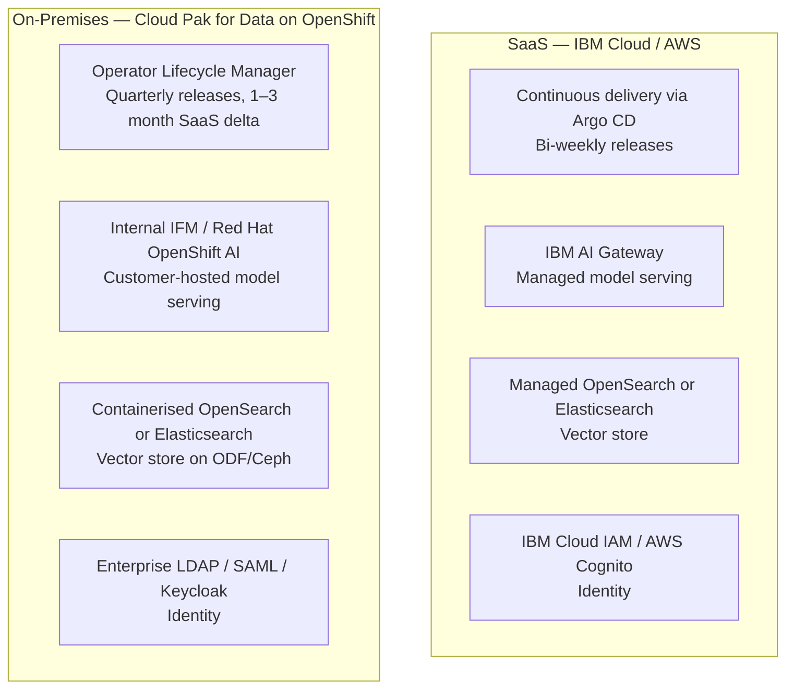

# Platform Editions

watsonx Orchestrate is delivered in two deployment editions: **SaaS** (hosted on IBM Cloud and AWS) and **On-Premises** via **Cloud Pak for Data (CPD)** on Red Hat OpenShift. Both editions share the same core runtime but differ in release cadence, model serving infrastructure, identity federation, and operational responsibility.

---

## Comparison Matrix

| Dimension | SaaS Edition | On-Premises CPD Edition |
|-----------|-------------|-------------------------|
| **Hosting** | Fully managed by IBM (AWS, IBM Cloud) | Customer-managed on Red Hat OpenShift |
| **Release cadence** | Bi-weekly continuous via Argo CD | Quarterly (1–3 month delta from SaaS) |
| **Current version** | **v5.4.4 GA** | Depends on CPD release cartridge |
| **Model serving** | IBM AI Gateway | Internal Foundation Model (IFM) stack / Red Hat OpenShift AI |
| **Vector store — AWS** | Amazon OpenSearch Service (managed) | — |
| **Vector store — IBM Cloud** | Elasticsearch (managed) | — |
| **Vector store — On-Prem** | — | Self-hosted OpenSearch or Elasticsearch on ODF |
| **Identity / IAM** | IBM Cloud IAM, AWS Cognito, enterprise SSO federation | Enterprise LDAP, SAML 2.0, OIDC, Keycloak |
| **Observability** | IBM Cloud Logs, hosted Datadog, OTel SaaS endpoints | Instana, Prometheus/Grafana, Splunk, OTel Collector |
| **Tenant isolation** | Logical multi-tenant with cryptographic separation | Physical namespace or cluster isolation |
| **Customer ops burden** | Zero infrastructure management | Cluster sizing, storage, upgrades, GPU scheduling |

---

## Version and Release Cadence

### SaaS Continuous Delivery

The SaaS edition runs on a continuous deployment model managed by **Argo CD** GitOps pipelines.

- **Cadence:** Updates deploy bi-weekly
- **Rollout strategy:** Canary deployments and blue-green cluster updates ensure zero-downtime upgrades for active chat sessions
- **Current GA version:** 5.4.4

### On-Premises Cloud Pak for Data

The on-premises edition is packaged as an OpenShift operator within the IBM Cloud Pak for Data ecosystem.

- **Cadence:** Quarterly release bundles with a **1 to 3 month delta** relative to SaaS
- **Upgrade mechanism:** OpenShift Operator Lifecycle Manager (OLM) with pre-upgrade health validation and air-gapped registry support

!!! note "Feature availability"
    Features shipping in a SaaS release may not be available in CPD until the next quarterly cartridge update. When assessing feature availability for on-premises customers, always check the CPD release notes, not the SaaS changelog.

---

## Model Serving Architecture

### SaaS: IBM AI Gateway

The SaaS edition routes model inference requests through the **IBM AI Gateway** — a high-performance layer that proxies to watsonx.ai hosted foundation models, third-party LLM providers (e.g., Anthropic Claude), and platform inference clusters. Gateway-level caching reduces redundant token processing for repeated prompt patterns.

### On-Premises: IFM and the Road to OpenShift AI

On-premises deployments currently use the **Internal Foundation Model (IFM)** serving framework deployed across GPU worker nodes on Red Hat OpenShift.

!!! note "Infrastructure roadmap"
    IBM is aligning on-premises model serving with **Red Hat OpenShift AI (RHOAI)**. In upcoming releases, the legacy IFM stack will be replaced by standard OpenShift AI components: KServe for model lifecycle management, vLLM execution kernels for lower Time-to-First-Token latency, and Caikit runtime layers. This transition provides customers with standardised GPU scheduling, dynamic autoscaling, and unified model governance across custom and IBM watsonx foundation models.

---

## Vector Store Deployment Details

| Deployment | Vector Store | Search Algorithm | Notes |
|------------|-------------|-----------------|-------|
| SaaS — AWS | Amazon OpenSearch Service (managed) | k-NN with HNSW indexing | Fully managed, auto-scaled |
| SaaS — IBM Cloud | Elasticsearch (managed) | Dense vector cosine similarity | Fully managed |
| On-Prem CPD | OpenSearch or Elasticsearch (containerised) | Same as cloud counterparts | Bound to OpenShift PVCs (ODF/Ceph) |

---

## Related References

- [Supported Models](models.md) — Model availability differences between editions and tenant tiers
- [Operations: Installation](../operations/installation.md) — Step-by-step CPD deployment guide
- [Operations: Architecture](../operations/architecture.md) — Network topology, ingress, and storage class configuration
- [Platform Roadmap](roadmap/platform-roadmap.md) — Long-term release milestones and the OpenShift AI migration timeline
