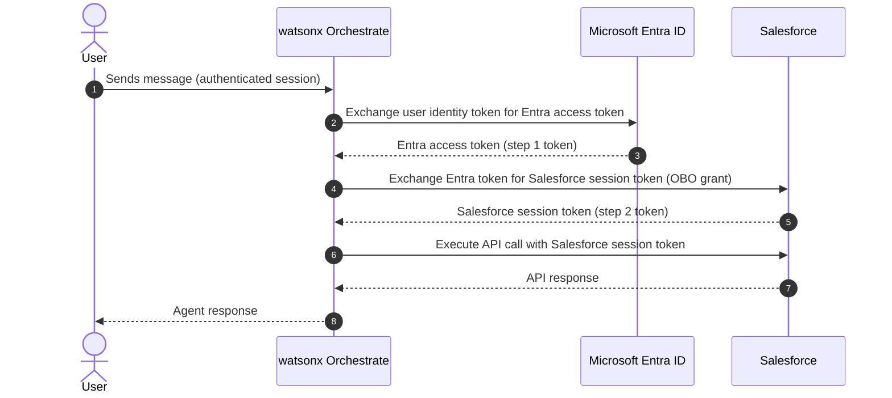
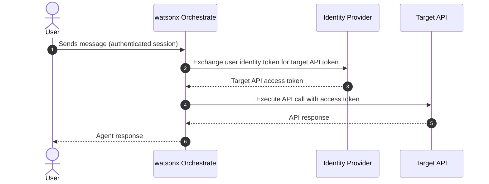

# Security

The watsonx Orchestrate security model is built around three principles: **zero credential exposure** (no secrets in prompts or logs), **delegated identity** (agents act as the user, not as a super-user), and **defence in depth** (encryption, isolation, and audit at every layer).

---

## On-Behalf-Of (OBO) Flow

The OBO flow is the mechanism by which an agent acts with the delegated authority of the authenticated end user when calling external enterprise systems. Instead of using a shared service account, the agent exchanges the user's identity token for a system-specific access token — ensuring that the target system sees the user's identity, permissions, and audit trail.

### Two-Step OBO (Entra ID + Salesforce)

Used when the target system requires an intermediate token exchange — for example, when Salesforce is secured by Microsoft Entra ID (Azure AD) and requires an Entra-issued token before issuing a Salesforce session token.

### One-Step OBO (Direct)

Used when the target system accepts the user's identity token directly — for example, an internal enterprise API secured by the same IdP as the agent's authentication.

!!! note "When to use which variant"
    Use the **two-step flow** when the target system is behind a separate IdP (e.g., Salesforce behind Entra ID, or Workday behind Okta). Use the **one-step flow** when your target API and your agent platform share the same IdP and the target system accepts that IdP's tokens directly.

---

## SSO Integration

watsonx Orchestrate supports federated single sign-on, allowing users to authenticate once through their enterprise IdP and have that identity propagated to the agent and all downstream systems it calls on their behalf.

### How SAML Assertions Flow

1. The user authenticates through their enterprise IdP (e.g., Okta, Microsoft Entra, Ping Identity)
2. The IdP issues a SAML 2.0 assertion
3. watsonx Orchestrate acts as the SAML Service Provider (SP), consumes the assertion, and creates an authenticated user session
4. The SAML assertion is encrypted and stored by Orchestrate for the duration of the session
5. When a tool requires delegated access, Orchestrate uses the stored assertion to initiate the appropriate OBO token exchange

### Slack + Okta + Workday Example

A common enterprise SSO pattern: users interact with the agent via Slack, authenticate through Okta, and the agent accesses Workday on their behalf.

1. User sends a message in the Slack channel
2. Slack prompts the user to log in via Okta (OAuth 2 Code flow)
3. Okta issues a SAML assertion and returns it to Orchestrate
4. Orchestrate encrypts and stores the assertion in the user's session context
5. When the agent calls a Workday tool, Orchestrate executes a two-step OBO exchange: Okta token → Workday session token
6. The Workday API call executes as the authenticated user

See [Cookbook: Slack + Okta + Workday SSO](../cookbook/slack-sso-workday.md) for the full configuration recipe.

---

## Credential Protection

All credentials managed by the Connections Manager are protected at every stage:

- **Encryption at rest:** All credential values (client secrets, API keys, access tokens, refresh tokens) are encrypted using AES-256 before storage in the platform database
- **No plaintext returns:** Once a credential is stored, it cannot be retrieved in plaintext through the UI or API — only the last four characters are displayed for identification
- **No credential in prompts:** The LLM context window never contains raw credential values; the Tool Runtime Manager injects tokens directly into HTTP request headers
- **Audit logging:** All connection creation, modification, and usage events are written to the platform audit log

!!! warning "Vault integration not yet available"
    watsonx Orchestrate does not currently integrate with external secret management systems (HashiCorp Vault, IBM Key Protect, AWS Secrets Manager). Credentials are managed within the platform's own encrypted store. External vault integration is on the product roadmap. For highly regulated environments, account for this limitation in your security architecture review.

### Data Residency

Credential data is stored in the same region as the tenant deployment. For SaaS deployments, this means:

- IBM Cloud (Dallas, Frankfurt, Tokyo, Sydney): credentials stored in the corresponding IBM Cloud region
- AWS (us-east-1, eu-west-1): credentials stored in the corresponding AWS region

For on-premises CPD deployments, credential data is stored within the customer's own OpenShift cluster.

---

## Embed Chat and OAuth

When exposing an agent through the Embed Chat widget (a website-embedded HTML snippet), member credentials using the **OAuth 2 Code** flow are supported, enabling the agent to act on behalf of the logged-in website user.

!!! warning "Availability"
    OAuth 2 Code support for Embed Chat member credentials is scheduled for the September mid-release. Until then, Embed Chat supports team credentials only.

---

## Security Checklist

!!! tip "Pre-deployment security review"
    Before promoting an agent to production, verify all of the following:

    - [ ] All tool connections use Live environment credentials (not Draft)
    - [ ] No API keys or secrets appear in system instructions or tool descriptions
    - [ ] Member credential connections are used wherever per-user audit trails are required
    - [ ] OBO is configured for all tools that access user-owned data in external systems
    - [ ] Token refresh behaviour has been tested by simulating expired tokens
    - [ ] Sensitive data classification is reviewed for any memory-enabled agents
    - [ ] Agent has been evaluated with adversarial prompts attempting credential extraction
    - [ ] Audit logging is enabled and being ingested by the customer's SIEM

---

## Related References

- [Connections](connections.md) — Authentication types, connection lifecycle, token refresh
- [Memory](memory.md) — Sensitive data classification in memory records
- [Channels](channels.md) — SSO configuration per channel
- [Cookbook: OBO Flow with Salesforce](../cookbook/obo-salesforce.md) — Detailed OBO configuration recipe
- [Cookbook: Slack + Okta + Workday SSO](../cookbook/slack-sso-workday.md) — End-to-end enterprise SSO recipe
