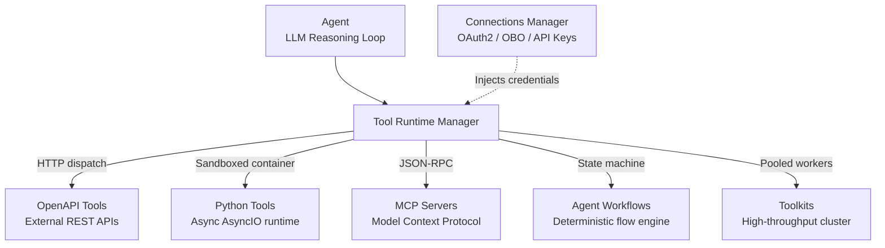

# Tool Types

Tools give watsonx Orchestrate agents the ability to interact with external systems, execute business logic, and retrieve live data. All tool execution is decoupled from the LLM reasoning loop and managed by the **Tool Runtime Manager** — an isolated, containerised subsystem responsible for schema validation, sandboxed execution, credential injection, and result streaming.

---

## OpenAPI Tools

**What it is:** RESTful API integrations defined via OpenAPI Specification (OAS) 3.0 or 3.1 documents (JSON or YAML).

**When to use:** Standard approach for integrating existing enterprise REST APIs — Salesforce, ServiceNow, SAP, Jira, Workday — where an HTTP interface already exists.

**Configuration:**

- Upload the spec via Tool Studio or register programmatically
- Every operation must have a unique `operationId`, concise `summary`, and comprehensive parameter `description` fields — the LLM uses these to extract and map arguments from user utterances
- Supports query parameters, path variables, request body schemas, and custom header injection

**Caveats:**

- Responses larger than ~50 KB should be server-side filtered or paginated before returning to the agent; large raw payloads consume context and degrade reasoning
- Strict schema enforcement: undeclared response fields or unexpected HTTP status codes trigger a tool execution exception

---

## Python Tools

**What it is:** Custom Python 3.11+ scripts executed inside isolated, secure container runtimes managed by the Tool Runtime Manager.

**When to use:** Complex data transformations, multi-API aggregations, mathematical calculations, or when you need libraries like `numpy`, `pandas`, or `requests` before returning results to the agent.

**Configuration:**

- Scripts must expose an async entrypoint: `async def main(params: dict) -> dict:`
- Type hints and docstrings are parsed to generate the tool's JSON schema interface for the LLM
- Standard packages are pre-cached via **VNV (Virtual Environment) caching** and **dependency pooling** to eliminate cold-start overhead
- Execution timeout: 30 seconds

!!! warning "Testing requires agent invocation"
    Direct standalone testing of Python tools in Tool Studio is not currently supported. Test your Python logic locally with mock inputs before uploading, then validate behaviour through agent invocation.

**Caveats:**

- Container local storage is ephemeral — destroyed on script completion
- File system access is restricted to the sandbox; no host filesystem access

---

## MCP Servers

**What it is:** Integrations with tools exposed via the **Model Context Protocol (MCP)** — an open standard by Anthropic for connecting AI models to external tools, resources, and prompt templates over JSON-RPC.

**When to use:** Standardising tool integration across diverse AI frameworks, leveraging community-built MCP servers (filesystem, Postgres, GitHub, Slack, etc.), or decoupling tool maintenance from the core platform.

**Configuration:**

- Supports `stdio` transport for local containerised servers and `SSE` (Server-Sent Events) for remote web-scale endpoints
- Tool schemas, resource URI templates, and prompts are dynamically discovered on connection — no manual schema upload required

**Caveats:**

- Remote SSE MCP servers must support TLS and enterprise authentication headers
- Monitor resource subscription streams to avoid unbounded context injection

---

## Agent Workflows

**What it is:** Visual, deterministic business process flows built in the Workflow Builder, registered and exposed to the agent as callable tools.

**When to use:** Business processes requiring deterministic sequence execution, strict conditional branching, multi-system transactional logic, or mandatory Human-in-the-Loop (HITL) approval steps.

**Configuration:**

- Built graphically using node types: API Call, Condition, Loop, User Approval, Script
- Exposed to the agent with defined input parameters and structured output schemas
- When invoked, the agent pauses its autonomous loop and hands execution to the workflow engine; it resumes once the workflow returns its final payload

**Caveats:**

- Workflows with asynchronous HITL approval nodes suspend the agent session until a user approves or an SLA timeout expires
- Not suitable for ad-hoc, unstructured interactions where the execution path is unknown at design time

See [Agentic Workflows](agentic-workflows.md) for the full specification.

---

## Toolkits

**What it is:** Performance-optimised, clustered deployments of related tools configured for high-concurrency, enterprise-scale execution.

**When to use:** Production environments with heavy concurrent user traffic where standard single-worker execution would experience request queuing and latency degradation.

**Configuration:**

- Deployed across three performance tiers with dedicated background worker pools
- Pre-warmed execution runtimes and dependency pooling eliminate cold starts
- Concurrent request capacity scales with tier selection

---

## Toolkit Performance Tiers

| Tier | Workers | Max Concurrent Requests | Typical Use Case |
|------|---------|------------------------|-----------------|
| **Small** | 5 | ~25 | Development, staging, low-volume internal tools |
| **Medium** | 9 | ~60 | Production departmental tools, moderate contact centre traffic |
| **Large** | 13+ | 150+ | Enterprise-wide deployments, high-volume webchat or voice channels |

---

## Tool Type Comparison

| Tool Type | Primary Use Case | Async Support | Direct Testing | Execution Environment |
|-----------|-----------------|---------------|----------------|-----------------------|
| **OpenAPI** | Standard enterprise REST APIs | Yes (HTTP async) | Yes, via API Inspector | Network proxy container |
| **Python** | Data manipulation, compute, aggregation | Yes (`asyncio`) | **No** — requires agent invocation | Isolated micro-container |
| **MCP Server** | Open-standard integrations | Yes (SSE / JSON-RPC) | Yes, via MCP Inspector | External or hosted RPC |
| **Agent Workflow** | Deterministic multi-step logic, HITL | Yes (state machine) | Yes, via Workflow Studio | BPMN flow engine |
| **Toolkit** | High-throughput production workloads | Yes (pooled workers) | Yes, via Toolkit Manager | Clustered worker pool |

---

## Related References

- [Agent Building Blocks](agent-building-blocks.md) — How tools interface with Skills, Instructions, and Connections
- [Agentic Workflows](agentic-workflows.md) — Full specification for the workflow node types
- [Connections](connections.md) — Configuring OAuth 2 and OBO auth for tool calls
- [Operations: Load Testing](../operations/load-testing.md) — Benchmarking tool execution and worker pool saturation
