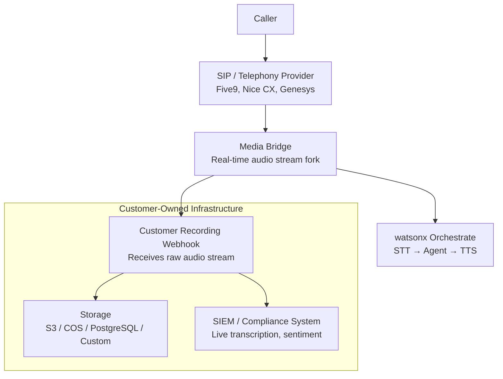

# Voice

watsonx Orchestrate supports voice-based interaction through a configurable voice layer that handles speech-to-text (STT), text-to-speech (TTS), telephony integration, and real-time call management. A single voice configuration can be shared across multiple agents (many-to-one relationship), and all audio processing respects enterprise data residency requirements — IBM never stores customer audio.

---

## Voice Configuration Schema

A voice configuration object defines the complete audio pipeline for agent telephone interactions:

```yaml
voice_config:
  name: "enterprise-en-us"
  stt:
    provider: watson_speech        # watson_speech | deepgram | google | azure | eleven_labs
    language: en-US
    model: telephony               # telephony | broadband | narrowband
  tts:
    provider: eleven_labs          # watson_tts | eleven_labs | google | custom
    voice_id: "rachel"
    speed: 1.0
    stability: 0.75
  dtmf:
    enabled: true
    terminator: "#"
  vad:
    enabled: true
    silence_threshold_ms: 800      # How long to wait before treating silence as end-of-turn
    min_speech_duration_ms: 200
  hold_messages:
    - "I'm looking into that for you now."
    - "Just a moment while I check."
    - "Let me pull that up."
  music_on_hold:
    enabled: false
```

---

## Speech-to-Text (STT) Providers

| Provider | Status | Languages | Notes |
|----------|--------|-----------|-------|
| **Watson Speech (IBM)** | GA | 20+ | Native IBM integration; optimal for IBM Cloud deployments |
| **DeepGram** | GA | 30+ | High accuracy for noisy telephony environments; low latency |
| **Google STT** | Coming soon | 125+ | Broad language coverage |
| **Azure Cognitive Speech** | Coming soon | 100+ | Strong enterprise support |
| **ElevenLabs** | Coming soon | 30+ | High-fidelity transcription |

!!! note "On-Prem CPD"
    On-premises deployments support Watson Speech and DeepGram. Cloud STT providers (Google, Azure) require outbound internet access and are only available when data residency policies permit external API calls.

---

## Text-to-Speech (TTS) Providers

| Provider | Status | Voices | Notes |
|----------|--------|--------|-------|
| **Watson TTS (IBM)** | GA | 20+ | Neural voices; native IBM integration |
| **ElevenLabs** | GA | 1000+ | Highest naturalness; ideal for brand-voiced deployments |
| **Google TTS** | GA | 380+ | Wide language and voice selection |
| **Custom endpoint** | GA | Custom | Bring-your-own TTS service via REST interface |

---

## DTMF — Dual-Tone Multi-Frequency

DTMF allows callers to use their phone keypad for input during a voice interaction. watsonx Orchestrate intercepts DTMF tones and translates them to text inputs for the agent.

**Configuration parameters:**

- `enabled` — activates DTMF detection
- `terminator` — the keypad character that signals end of input (default: `#`)
- Use DTMF for PIN entry, menu navigation, or numeric data capture that is error-prone via speech recognition

---

## VAD — Voice Activity Detection

VAD monitors the audio stream to detect when the caller has stopped speaking, signalling the agent to process the turn.

**Configuration parameters:**

- `silence_threshold_ms` — duration of silence (in milliseconds) after which the agent begins processing (default: 800ms). Lower values feel more responsive but may cut off slow speakers. Higher values are more tolerant of pauses but feel sluggish.
- `min_speech_duration_ms` — minimum duration of detected speech before VAD triggers (filters out clicks, coughs, background noise)

---

## Hold Messages and Variation

When the agent invokes a tool during a voice interaction, there is a processing gap. Without audio feedback, callers experience dead air and may hang up. Hold messages fill this gap.

**Best practices:**

- Configure at least 3–5 hold message variants to avoid repetitive responses on long tool chains
- Keep messages between 3–8 seconds of speech
- Use transitional language ("I'm checking that now", "One moment", "Let me look that up") rather than filler words
- For the Go runtime (lower latency), shorter hold messages are appropriate

Hold messages are randomly selected from the configured list by the runtime.

---

## Call Recording Architecture

watsonx Orchestrate is designed for **zero IBM audio storage** — customer audio is never stored on IBM infrastructure. The call recording architecture is entirely customer-owned.



**How it works:**

1. The telephony provider forks the media stream
2. One fork goes to Orchestrate for STT processing and agent response
3. The other fork is streamed to the customer's webhook endpoint in real-time
4. The customer stores and processes the audio independently — IBM has no access to it

This architecture satisfies data residency and compliance requirements in highly regulated industries (financial services, healthcare, government) where audio recording must remain within the customer's own infrastructure.

---

## Telephony Integration Options

### Option 1: Embed Chat Voice Widget

A JavaScript HTML snippet added to any web page that activates a voice interface in the browser. No telephony infrastructure required — uses WebRTC.

**Use when:** Deploying voice on web properties, internal portals, or demo environments.

### Option 2: SIP Trunking

Standard SIP (Session Initiation Protocol) integration with existing telephony infrastructure.

| Deployment | SIP Provider Examples |
|------------|----------------------|
| Cloud / SaaS | Five9, Nice CX One |
| On-premises | Session border controller (customer-managed) |

**Use when:** Integrating with an existing contact centre or PBX infrastructure using standard telephony protocols.

### Option 3: Genesys Connector

A dedicated integration for Genesys Cloud CX customers. Simpler to configure than raw SIP — uses Genesys's bot framework to connect Orchestrate as a bot resource.

**Use when:** The customer is already running Genesys Cloud CX as their contact centre platform. Prefer over SIP trunking for Genesys environments.

---

## Go Runtime and Latency

The **Go Runtime** is an alternative agent execution runtime (available from the September release) that delivers significantly lower end-to-end response latency compared to the standard runtime. For voice interactions, where latency directly impacts conversation naturalness, the Go runtime is strongly recommended.

!!! note "Go Runtime availability"
    The Go runtime is available from the September release in select SaaS regions. Check the current availability matrix for your deployment region before planning a voice deployment.

**Go Runtime limitations (current):**

- No `guideline` support (the Guidelines feature is deprecated in the Go runtime)
- No Go tool type support
- Async tool calling limited to OpenAPI with callback URLs

---

## Data Residency

!!! warning "Audio never stored on IBM infrastructure"
    Customer audio streams are never stored by IBM. All audio data flows through and is discarded by the IBM STT processing layer immediately after transcription. Transcriptions (text) are retained as part of the normal conversation trace, subject to the standard 30-day retention policy.

    For deployments where even transcription data must remain on-premises, use the on-premises CPD edition with Watson Speech deployed in the customer's own cluster.

---

## Related References

- [Channels](channels.md) — Full channel matrix including voice alongside digital channels
- [HOWTO: Set Up Voice](../howto/set-up-voice.md) — End-to-end voice configuration walkthrough
- [Voice Roadmap](roadmap/voice-roadmap.md) — Upcoming STT/TTS providers, Go runtime expansion, per-tenant TTS customisation
- [Lab 9: Voice & Channels](../labs/lab-09-voice-channels.md) — Hands-on lab configuring voice and Slack channels
